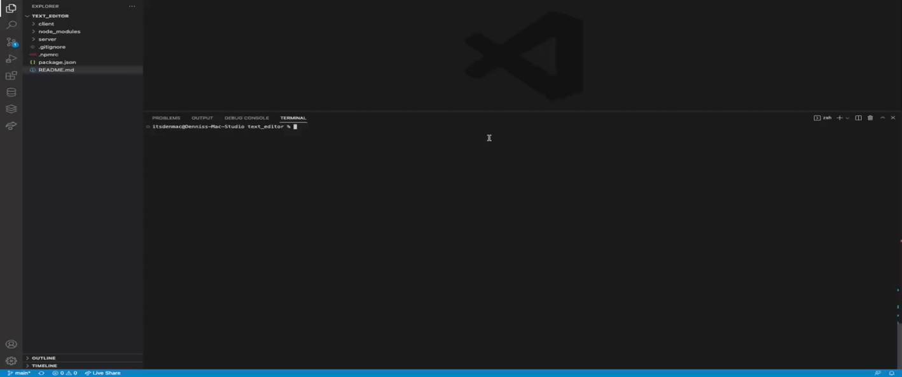
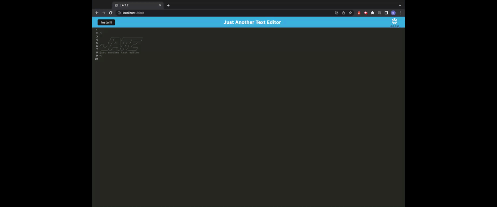
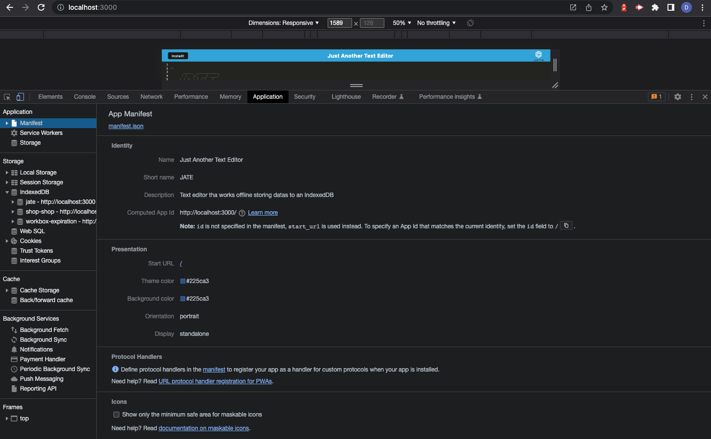
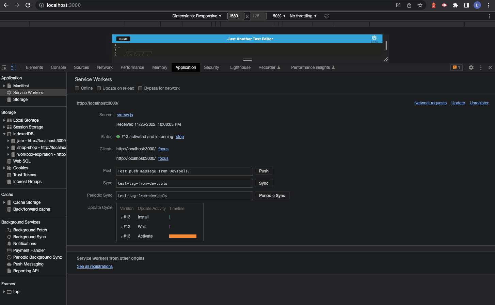

# Text Editor (JATE)
This is a text editor app that runs on the browser. This app can be used to create notes or code snippets with or without an internet connection. 

This is a single-page application that meets the PWA criteria. 

## User Story
> As A developer

> I WANT to create notes or code snippets with or without an internet conneciton

> SO THAT I can reliably retrieve them for later use.

## Installation or Use
In able to execute the text editor, you will have to `git clone` the repository into your local storage. This will enable you to access all the files locally.
 
[GitHub Link](https://github.com/itsDenMat/text_editor)

* Run `npm install` in order to have npm package dependencies installed.
    * The text editor will start once the user enters `npm start` in the command line.
    * Once the server is running, user will be able to access the text editor throught `http://localhost:3001`

* Another way to use this application is through the heroku link bellow:
 
[JATE Text Editor](https://denmat-text-editor.herokuapp.com/)

# Usage
User will be able to do the following:
> User will be able to enter any texts to create a note or code snippets.

> User will be able to find the content in the text editor after closing and reopening the application.

> User will be able to install the application and have it downloaded as an icon on the desktop.

## Demo
* Installing and running application.

* Basic functionality of texts.

* Installation of application.

* Text remains in the text editor application after closing and reopening.

* Application's `manifest.json` file.

* Application's registered service worker

